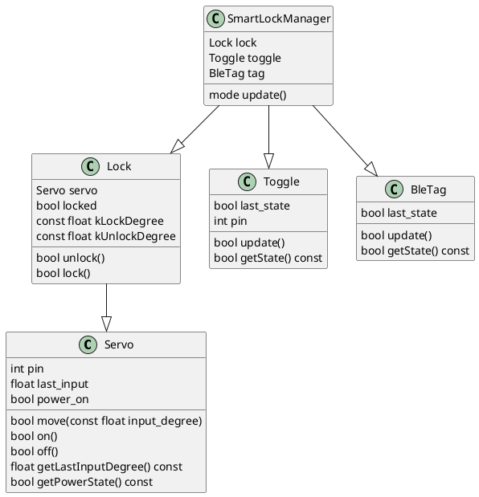

# SmartLock

# 概要
スマートロックを自作する。

# 要件

## UI
- 解錠・解錠方法(外)
  - BLEビーコンの検知
  - 物理鍵
- 解錠・施錠方法(内)
  - 物理ボタン
- 在室判定
  - 物理ボタン

## 機能

- BLEビーコンの電波強度検出
- サーボモータ操作によるサムターン操作
- FETのスイッチングによるサーボモータの電源操作
- 物理ボタン(トグルスイッチ)の検出
- 電池駆動
- 電池取り換え可能

# 詳細設計

## ソフトウェアアーキテクチャ

